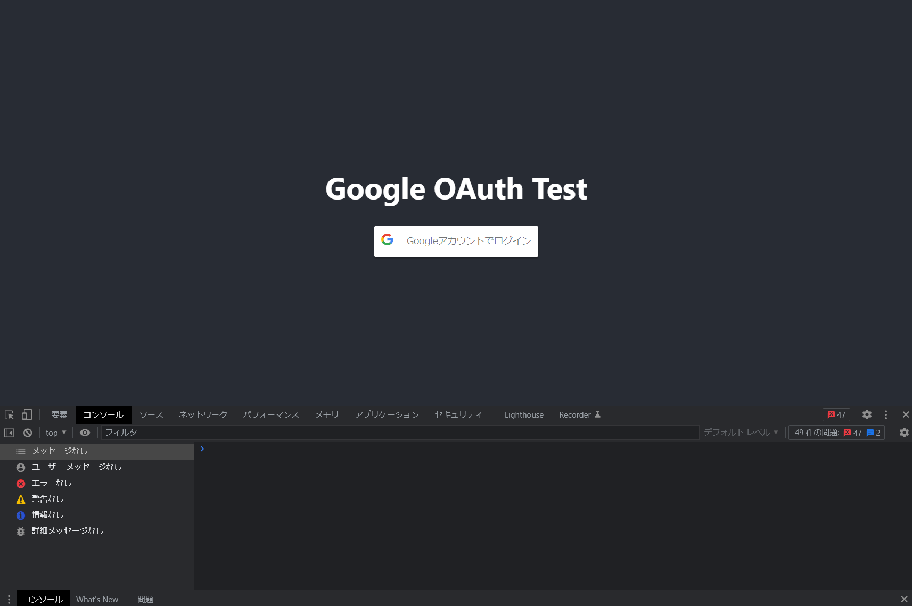
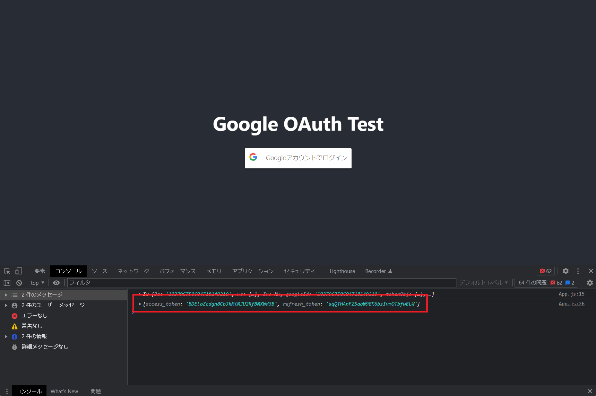
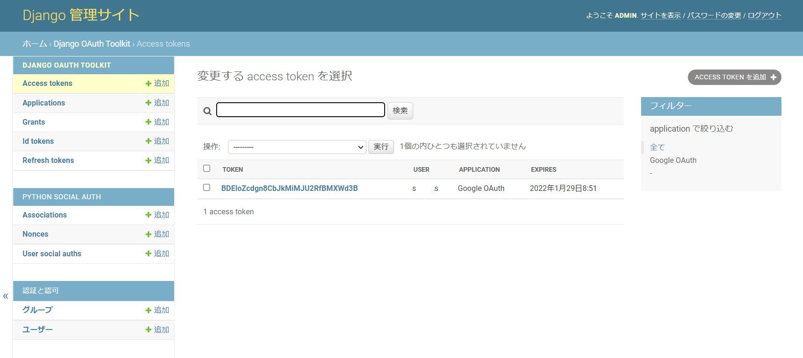

# Part3. フロントエンド作成

[前パート](./part2.md)で起動したDjangoは起動したままにして、
新しいターミナルを開いて作業します

## 1. React プロジェクト作成

```shell
$ cd ../
$ npx create-react-app frontend
$ cd frontend
```

## 2. ライブラリインストール

```shell
$ npm i react-google-login axios
```

- react-google-login : ReactでGoogleLogin関連の便利なツールを提供してくれます facebookのやつとかもあるので、余力があれば導入しよう
- axios : HTTPクライアントです DRFのAPIをたたくのに使います fetchでもいいと思います

## 3. .env作成

Google Cloudで発行したOIDC鍵の`CLIENT_ID`と、
[さっき](./part2#管理ページ)Djangoの管理画面で作成したApplicationに記載されていた`Client d`,`Client secret`を変数として格納します

```sh
$ vi .env

REACT_APP_GOOGLE_CLIENT_ID=499058585498-xxxxxxxxxxxxx.apps.googleusercontent.com
REACT_APP_DRF_CLIENT_ID=ZEmxjwB8IjA1OiD7R6AY3aBUrho4X080yqeOxxxx
REACT_APP_DRF_CLIENT_RECRET=Taj1m0q8QXlGmTDr3IJasuEVJ1M2n7dxxxx
```

## 4. フロント画面作成

いよいよボタンを画面に表示していきます

- ライブラリインポート

```js:App.js
// ライブラリインポート
import GoogleLogin from "react-google-login";
import axios from "axios";
```

- 変数設定

```js:App.js
// .env情報取得
const googleClientId = process.env.REACT_APP_GOOGLE_CLIENT_ID;
const drfClientId = process.env.REACT_APP_DRF_CLIENT_ID;
const drfClientSecret = process.env.REACT_APP_DRF_CLIENT_RECRET;
const baseURL = "http://localhost:8000";
```

- ボタン表示

`<GoogleLogin {option} />` で表示する

```js:App.js
function App() {
  return (
    <div className="App">
      <header className="App-header">
        <h1>Google OAuth Test</h1>
        <GoogleLogin
            clientId={googleClientId}
            buttonText="Googleアカウントでログイン"
            onSuccess={(response) => handleGoogleLogin(response)}
            onFailure={(err) => console.log("Google Login failed", err)}
        ></GoogleLogin>
      </header>
    </div>
  );
}
```

- 認証成功時の関数作成(=onSuccess)

```js:App.js
// 認証成功時の動作
const handleGoogleLogin = (response) => {
    axios
        .post(`${baseURL}/auth/convert-token`, {
            token: response.accessToken,
            backend: "google-oauth2",
            grant_type: "convert_token",
            client_id: drfClientId,
            client_secret: drfClientSecret,
        })
        .then((res) => {
            const { access_token, refresh_token } = res.data;
            console.log({ access_token, refresh_token });
            localStorage.setItem("access_token", access_token);
            localStorage.setItem("refresh_token", refresh_token);
        })
        .catch((err) => {
            console.log("Error Google Login", err);
        })
}
```

/auth/convert-token に googleで発行されたToken情報(=response.accessToken)を載せてPOSTすると、
DRFが`access_token`と`refresh_token`に変換した値をResponseで返してくれる

返ってきた値はステートに保存した後、コンソールログに出力、
ローカルストレージにそれぞれ保存する

## 確認



ボタンを押すと、↓のようによく見るGoogleログインのポップアップが出てくる


ユーザを選択して認証



ここで認証が成功して、onSuccess関数が実行される



DRFで変換されたToken情報がコンソールに出てくる

# フロントエンド完了

お疲れ様です！

これにてReact,DRFとの連携が完了です
後はJWTの情報をもとにあれやこれやフロントで表示したりするだけですね

[次のパート](./part4.md)ではユーザ情報表示とログアウト処理を作っていきます