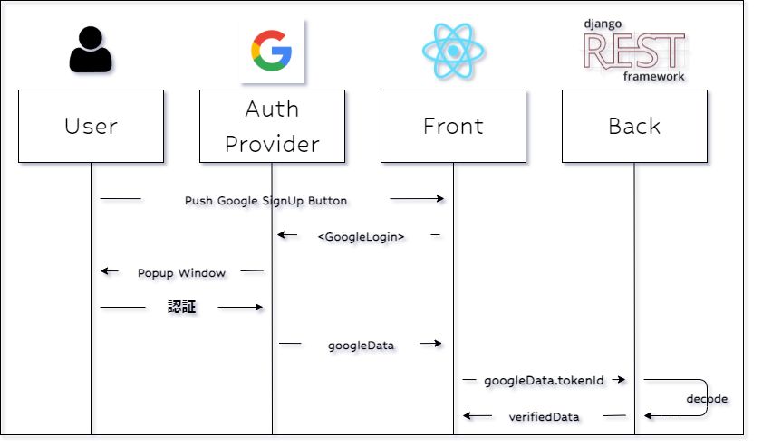

# 【絶対にできる！】Googleログインボタンの実装【4/6】

本記事は、React × DjangoRESTFramework で Googleログインボタン を実装するチュートリアル  
全6partのうちのpart4です  
part1から読む場合は[こちら](./part1.md)  
part0(導入偏)は[こちら](./part0.md)

# JWTデコード →ユーザ情報取得 (React)

## 0. 流れの理解

このpartの流れは以下の通りです。

1. djangoにてusersアプリ作成
2. view関数作成
3. APIテスト
4. APIを叩くフロントの関数を作成

## 1. tokenId(jwt)を検証・デコードする関数作成 (Django REST Framework)

前回のpartで GoogleLoginボタンを押し認証を行うと  
フロントにgoogleに登録されているユーザの情報が返ってくることが分かりました

この情報の中に、ユーザ情報をJWTとして暗号化されている`tokenId`があります

`tokenId`をデコードし、ユーザ名とemailアドレス、登録写真のURLの3つを取り出します



まず、GoogleOAuthで入手したJWTを検証したりデコードしたりするのに便利なライブラリ、
[google-auth](https://google-auth.readthedocs.io/en/master/index.html)をインストールします

backend, frontエンドは起動したままにして  
また新しいターミナルを開き、仮想環境に入ります

```shell
$ cd ~/
$ source tutorial/bin/activate
$ pip install --upgrade google-auth
```

### アプリケーション追加

```shell
$ cd backend
$ python manage.py startapp users
```

※後でカスタムユーザを作成予定なのでこのapp名にしました

### アプリケーション登録

```py:settings.py
INSTALLED_APPS = [
    # apps
    'users',
]
```

### View関数作成

```py:users/views.py
from rest_framework import permissions, status
from rest_framework.decorators import api_view, permission_classes
from rest_framework.response import Response
from google.oauth2 import id_token
from google.auth.transport import requests
from decouple import config

@api_view(['POST'])
@permission_classes([permissions.AllowAny])
def verifyToken(request):
    req = requests.Request()
    token = request.data['tokenId']
    audience = config("SOCIAL_AUTH_GOOGLE_OAUTH2_KEY")
    user_google_info = id_token.verify_oauth2_token(token, req, audience)
    return Response(user_google_info, status=status.HTTP_200_OK)
```

先ほどインストールした`google-auth`を使って検証&デコード処理を作ります

- @api_view(['POST']) : 関数をAPIとして扱うためのDRFのデコレータです
- @permission_classes : api_viewでパーミッションの指定ができるようになるデコレータ 

- token = request.data['tokenId'] : 後でフロントでHTTPリクエストを送信する処理を作るときに、リクエストボディに`tokenId`を入れるようにします

- id_token.verify_oauth2_token(token, request, audience) : この処理の核の部分です 第1引数のトークンを検証し、デコードしてくれます
  - token : JWTトークンが入ります String
  - request : [公式](https://google-auth.readthedocs.io/en/master/reference/google.oauth2.id_token.html)によると`google-auth`が様々なHTTPクライアントを受け付けるために必要みたいです
  - audience : GCPで発行したOAuth2のClient_IDのことです

	google-authの詳細については[こちら](https://google-auth.readthedocs.io/en/master/)を確認してみてください

- return Response(user_google_info) : デコードされて丸裸になったデータをフロントに返します

### URL登録

作ったViewにURLを振ります

まずusersのurlをプロジェクトのurlに読み込ませます

```py:backend/urls.py
from django.contrib import admin
from django.urls import path, include

urlpatterns = [
    path('admin/', admin.site.urls),
    path('auth/', include('drf_social_oauth2.urls', namespace='drf')),
    path('', include('users.urls')), #
]
```

usersにはurls.pyがないので作成します

```
$ vi users/urls.py
```

usersのurlは↓の通りです

```py:users/urls.py
from django.urls import path, include
from . import views

urlpatterns = [
    path('verify-token/', views.verifyToken, name='verify-token'),
]
```

### APIテスト

ここで、APIのテストをしてみます
`httpie`というHTTPクライアントを使ってHTTPリクエストをDRFに送ってみましょう

まずはhttpieをインストール

```sh
$ pip install httpie
```

[part3](./part3.md)で発行した、googleToken(Iw から始まるjson)の中にある`tokenId`と、  
同じくgoogleTokenの中にあるaccessTokenが、DRFによって変換された値である`access_token`  
この2つをリクエストに含めて、さっき作ったViewにPOSTすると、  
tokenId(jwt)をデコードしたものがレスポンスで返ってきます

```sh
$ tokenId="tokenIdをコピペ"

$ http POST http://127.0.0.1:8000/verify-token/ tokenId=${tokenId}

HTTP/1.1 200 OK
Allow: OPTIONS, POST
Content-Length: 567
Content-Type: application/json
Date: Thu, 03 Feb 2022 16:00:55 GMT
Referrer-Policy: same-origin
Server: WSGIServer/0.2 CPython/3.6.8
Vary: Accept, Origin
X-Content-Type-Options: nosniff
X-Frame-Options: DENY

{
    "at_hash": "01Uh~~",
    "aud": "4990~~.apps.googleusercontent.com",
    "azp": "4990~~.apps.googleusercontent.com",
    "email": "youremailaddress@gmail.com",
    "email_verified": true,
    "exp": 1643907574,
    "family_name": "苗字",
    "given_name": "名前",
    "iat": 1643903974,
    "iss": "accounts.google.com",
    "jti": "ec1824~~~",
    "locale": "ja",
    "name": "苗字 名前",
    "picture": "https://lh3.googleusercontent.com/~~~~~",
    "sub": "103796~~~~"
}
```

こんな感じでデータが返ってきたらOKです！

- http
  - POST : POSTを明示してリクエストを送信します つけないと、GETで送られてしまいます
  - verify-token/ : 最後に`/(スラッシュ)`を入れないとエラーが起こってしまいます このあたり自動で補完してほしいがやり方が分からない、、
  - tokenId : このtokenIdはリクエストのボディとして送信します

## 2. フロントからAPIをたたく (React)

### MIDDLE_WARE 修正

この後フロントからAPIをたたく関数を作るのですが、  
corsheadersのMiddlewareがdjangoのCommonMiddlewareより下にあるとCORS設定がうまく動かなくなるため、  
上に持ってきましょう(上過ぎてもだめらしいのでcommonをcorsheaderの下に持ってきました)

```py:backend/settings.py
MIDDLEWARE = [
    'django.middleware.security.SecurityMiddleware',
    'django.contrib.sessions.middleware.SessionMiddleware',
    #'django.middleware.common.CommonMiddleware',
    'django.middleware.csrf.CsrfViewMiddleware',
    'django.contrib.auth.middleware.AuthenticationMiddleware',
    'django.contrib.messages.middleware.MessageMiddleware',
    'django.middleware.clickjacking.XFrameOptionsMiddleware',

    # 以下追加
    'corsheaders.middleware.CorsMiddleware',
    'django.middleware.common.CommonMiddleware',
]
```

### 関数作成

先ほどは`httpie`を使って情報を取得しましたが、  
同じような処理をする関数をフロントに作成します

HTTPクライアントは`axios`を使います

```js:App.js
function App() {

  const convertToken = async (userAccessToken) => {
    const token = userAccessToken
    return await axios
    .post(`${baseURL}/auth/convert-token`, {
      token: token,
      backend: "google-oauth2",
      grant_type: "convert_token",
      client_id: drfClientId,
      client_secret: drfClientSecret,
    })
    .then((res) => {
      const { access_token, refresh_token } = res.data;
      localStorage.setItem("access_token", access_token);
      localStorage.setItem("refresh_token", refresh_token);
      return access_token
    })
    .catch((err) => {
      console.log("Error Google Login", err);
    })
  }

  const handleGoogleLogin = (response) => {

  }

  return (
    // 略
  );
}
```

まずは分かりやすいようにconvert-tokenをPOSTする部分を関数として切り出します

関数の返り値として、drfで発行した`access_token`を返したいので、  
axios の前に `return` また、.thenで実行される関数でも `return access_token`とします  
これで、convertToken()の返り値が `access_token` になります

- 参考:
  - [axiosでレスポンスを返すメソッドを作成したがコンポーネント側でうまく使用できない](https://teratail.com/questions/235618)
  - [async/awaitで非同期処理させた結果を返り値としてreturnしたい](https://qiita.com/HorikawaTokiya/items/9822ba5af62b2ba92987)

### tokenIdをデコードするAPIを叩く関数

```js:App.js
import { useState } from 'react';

function App() {

  const convertToken = async (googleData) => {
		// 略
	}

	const verifyToken = async (googleToken) => {
		const token = googleToken
		return await axios
      .post(`${baseURL}/verify-token/`,
				{ tokenId: token },
			)
			.then((res) => {
				const user_google_info = res.data
				return user_google_info
			})
			.catch((err) => {
				console.log("Error Verify Token", err)
			})
	}

	const handleGoogleLogin = async (googleData) => {

    // ユーザのGoogle:accessTokenをconvertする
		const userAccessToken = googleData.accessToken
		const drfAccessToken = await convertToken(userAccessToken)

    // tokenIdをデコード
		const userJWT = googleData.tokenId
		const userDetail = await verifyToken(userJWT)
		console.log(userDetail)
	}

  return (
		// 略
```

- verifyToken :
  - const token = googleToken.tokenId : `tokenId`の値を変数に入れます
  - axios :
    - .post : axiosのpostで、/verify-token/を叩きます ボディに`tokenId`の情報を付与してPOSTします
    - .then : APIが正常に値を返して来たら、responseデータをuser_google_info変数に格納します
  - convertTokenの時と同様、await と user_google_info の前に`return`を付けます

- handleGoogleLogin :
  - verifyTokenを実行した結果のレスポンスをコンソール出力します

これで実際にReact起動して、ログインボタンを押してみます

Google認証を経て、コンソールに`userDetail`のJSONが表示されれば成功！

# part4 終了

お疲れ様でした

google認証後、JWT内のユーザのGoogle情報をデコードして  
フロントに返してくることができるようになりましたね

[次のpart](./part5.md)からはこのデータを用いてユーザ登録、ログインできるよう用にしていきます

余談ですが、  
axiosとかstateに全く慣れてなく、この機能実装するのに1週間くらいかかりました、、